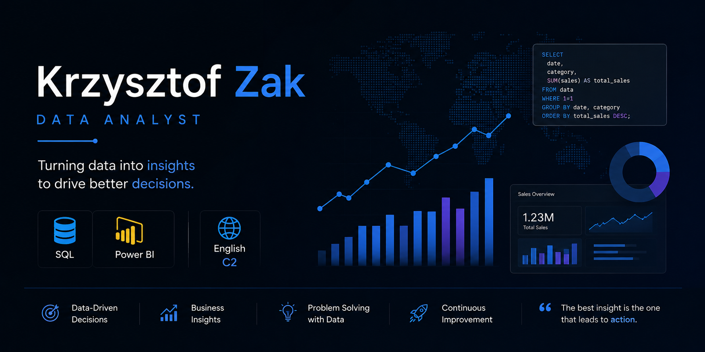

# Hi, I'm Krzysztof Zak 👋

### Data Analyst | SQL Developer | Power BI Enthusiast

I am a Data Analyst passionate about transforming raw data into meaningful business insights. My work focuses on data analytics, data warehousing, reporting, and business intelligence solutions that support data-driven decision-making.

I enjoy working with structured data, building analytical models, and delivering actionable insights through SQL and Power BI.

---

## About Me

- 📊 Data Analytics & Business Intelligence
- 🗄️ SQL Server Development
- 🏗️ Data Warehouse Design
- 📈 Reporting & KPI Analysis
- 📉 Data Visualization with Power BI
- 🌍 Fluent English (C2)
- 🚀 Continuously improving analytical and business skills

---

## Tech Stack

### Databases & Querying

### Analytics & BI

### Version Control

---

# Featured Projects

## 🏗 SQL Data Warehouse Project

A complete SQL Server Data Warehouse solution built using CRM and ERP source systems.

### Key Features

- Data Warehouse Architecture
- ETL Pipelines
- Data Integration
- Data Cleansing
- Data Modeling
- Star Schema Design
- Business-Oriented Reporting Layer

### Skills Demonstrated

- SQL Server Development
- Data Engineering Fundamentals
- ETL Design
- Data Transformation
- Data Warehouse Modeling

🔗 Repository:

https://github.com/krzysztof-zak/sql-data-warehouse-project

---

## 📊 SQL Data Analytics Project

A business-focused analytics project built entirely in SQL, designed to generate meaningful insights from sales and customer data.

### Customer Analytics

- Customer Segmentation
- Revenue Analysis
- Customer Lifetime Value
- Average Order Value
- Recency Analysis
- KPI Tracking

### Product Analytics

- Product Performance Analysis
- Revenue Tracking
- Sales KPIs
- Product Segmentation
- Business Reporting

### SQL Techniques

- Common Table Expressions (CTEs)
- Aggregations
- CASE Statements
- Window Functions
- Views
- KPI Calculations

🔗 Repository:

https://github.com/krzysztof-zak/sql-data-analytics-project

---

## 📁 SQL Analytics Portfolio

A collection of SQL analytics case studies and business-focused reporting solutions demonstrating practical analytical skills and SQL best practices.

### Portfolio Highlights

- Business-Oriented SQL Analysis
- KPI Development
- Data Exploration
- Reporting Solutions
- Data Quality Checks
- Performance Metrics

### Skills Demonstrated

- Analytical Thinking
- Data Interpretation
- Business Analysis
- SQL Query Optimization
- Insight Generation

🔗 Repository:

https://github.com/krzysztof-zak/sql-analytics-portfolio

---

## Core Competencies

### Data Analytics

- Data Cleaning
- Data Exploration
- Business Analysis
- KPI Development
- Trend Analysis

### SQL

- Complex Queries
- Joins
- Subqueries
- Window Functions
- Views
- CTEs
- Stored Procedures

### Business Intelligence

- Dashboard Design
- Reporting
- Performance Monitoring
- Data Visualization
- Stakeholder-Focused Insights

---

## Currently Working On

- Advanced Power BI
- DAX
- Data Storytelling
- Dashboard Design
- Business Intelligence Solutions
- Data Visualization Best Practices

---

## GitHub Stats

---

## Professional Goal

My goal is to leverage data to support better business decisions by combining strong SQL expertise, analytical thinking, and business understanding.

> Turning data into insights that drive better decisions.

---

## Connect With Me

- GitHub: https://github.com/krzysztof-zak
- LinkedIn: www.linkedin.com/in/krzysztof-zak

<!--
**krzysztof-zak/krzysztof-zak** is a ✨ _special_ ✨ repository because its `README.md` (this file) appears on your GitHub profile.

Here are some ideas to get you started:

- 🔭 I’m currently working on ...
- 🌱 I’m currently learning ...
- 👯 I’m looking to collaborate on ...
- 🤔 I’m looking for help with ...
- 💬 Ask me about ...
- 📫 How to reach me: ...
- 😄 Pronouns: ...
- ⚡ Fun fact: ...
-->
